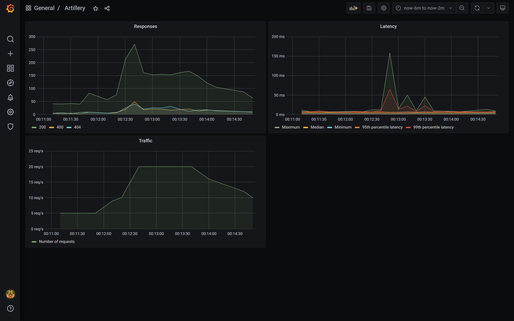

# Proof of Concept - Artillery

## Introduction
A Proof of Concept for using [Artillery](https://artillery.io/) for backend performance testing, publishing metrics to [InfluxDB 2.0](https://docs.influxdata.com/influxdb/v2.0/get-started/) through [Telegraf](https://www.influxdata.com/time-series-platform/telegraf/), and displaying them using [Grafana](https://grafana.com/).



## Prerequisite
- [Docker](https://www.docker.com/)
- [Node.js](https://nodejs.org/en/)

## Run and setup testing infrastructure
1. Run Docker Compose: ```docker-compose up -d```
   - This will run [InfluxDB 2.0](http://localhost:8086), Telegraf, [Grafana](http://localhost:3000/) and a [Weather Forecast API](http://localhost:5000/weatherForecast)

2. Go to your [Grafana](http://localhost:3000/) and log in
   - username: `admin`
   - password: `admin`

3. Connect Grafana to Influx DB
   - Go to [Add data source](http://localhost:3000/datasources/new), select InfluxDB and configure the following

      ```yaml
      Query Language: Flux # InfluxDB 2.0
      HTTP:
        URL: http://influxdb2:8086 # InfluxDB address inside Docker
      Auth:
        Basic auth: false # Turn off Basic Auth
      InfluxDB Details:
        Organization: poc-organization
        Token: my-super-secret-auth-token # You should issue a new Read-Only access token for Grafana in your InfluxDB
        Default Bucket: poc-artillery.io
      ```

4. Create a new Grafana Dashboard (_you can find the finished dashboard [here](./templates/grafana/dashboard-weather-forecast.json)_)
    - Go to [Dashboards](http://localhost:3000/dashboards) and click [New Dashboard](http://localhost:3000/dashboard/new)
    - Click `Add an empty panel`
      - **Responses**
        - Panel (Settings)
          - Panel title: `Responses`
        - Query

          ```
          from(bucket: "poc-artillery.io")
            |> range(start: v.timeRangeStart, stop: v.timeRangeStop)
            |> filter(fn: (r) =>
                  r["_measurement"] == "artillery_response_1xx" or
                  r["_measurement"] == "artillery_response_2xx" or
                  r["_measurement"] == "artillery_response_3xx" or
                  r["_measurement"] == "artillery_response_4xx" or
                  r["_measurement"] == "artillery_response_5xx")
            |> aggregateWindow(every: v.windowPeriod, fn: mean, createEmpty: false)
            |> yield(name: "mean")
          ```

        - Overrides (Fields with name matching regex)
          - 1xx Responses
            - RegEx: `artillery_response_1xx.+`
            - Display name: `1xx`
          - 2xx Responses
            - RegEx: `artillery_response_2xx.+`
            - Display name: `2xx`
          - 3xx Responses
            - RegEx: `artillery_response_3xx.+`
            - Display name: `3xx`
          - 4xx Responses
            - RegEx: `artillery_response_4xx.+`
            - Display name: `4xx`
          - 5xx Responses
            - RegEx: `artillery_response_5xx.+`
            - Display name: `5xx`

      - **Latency**
        - Panel (Settings)
          - Panel title: `Latency`
        - Field (Standard options)
          - Unit: `milliseconds (ms)` (under _Time_)
        - Query

          ```
          from(bucket: "poc-artillery.io")
            |> range(start: v.timeRangeStart, stop: v.timeRangeStop)
            |> filter(fn: (r) =>
                  r["_measurement"] == "artillery_latency_max" or
                  r["_measurement"] == "artillery_latency_median" or
                  r["_measurement"] == "artillery_latency_min" or
                  r["_measurement"] == "artillery_latency_p95" or
                  r["_measurement"] == "artillery_latency_p99")
            |> aggregateWindow(every: v.windowPeriod, fn: mean, createEmpty: false)
            |> yield(name: "mean")
          ```

        - Overrides (Fields with name matching regex)
          - Maximum latency
            - RegEx: `artillery_latency_max.+`
            - Display name: `Maximum`
          - Median latency
            - RegEx: `artillery_latency_median.+`
            - Display name: `Median`
          - Minimum latency
            - RegEx: `artillery_latency_min.+`
            - Display name: `Minimum`
          - 95th percentile latency
            - RegEx: `artillery_latency_p95.+`
            - Display name: `95th percentile latency`
          - 99th percentile latency
            - RegEx: `artillery_latency_p99.+`
            - Display name: `99th percentile latency`

      - **Traffic**
        - Panel (Settings)
          - Panel title: `Traffic`
        - Field (Standard options)
          - Unit: `requests/sec (rps)` (under _Throughput_)
        - Query

          ```
          from(bucket: "poc-artillery.io")
            |> range(start: v.timeRangeStart, stop: v.timeRangeStop)
            |> filter(fn: (r) => r["_measurement"] == "artillery_rps_mean")
            |> aggregateWindow(every: v.windowPeriod, fn: mean, createEmpty: false)
            |> yield(name: "mean")
          ```

        - Overrides (Fields with name matching regex)
          - Maximum latency
            - RegEx: `value.+`
            - Display name: `Number of requests`

## Run Tests
1. Install dependencies in folder test/performance-testing/: ```npm install```
2. Run tests in same folder: ```npm run weather-forecast```

# Authors
- Tomas Svejnoha
  - GitHub: [svejnohatomas](https://github.com/svejnohatomas)
  - LinkedIn: [Tomáš Švejnoha](https://www.linkedin.com/in/tomas-svejnoha/)
